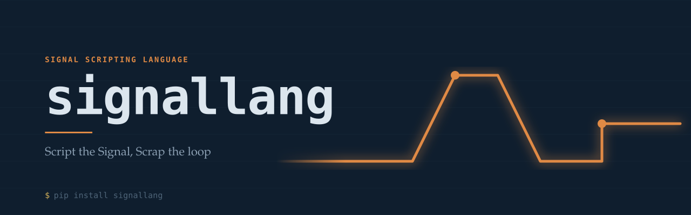

# signallang

[](https://pypi.org/project/signallang/)
[](https://github.com/KhiemGOM/signallang/actions/workflows/test.yml)

Scripting language for publishing synthetic signals — structured data
that changes over time on a defined schedule (e.g. ramp 20→30 over 10s,
sent at 2Hz), independent of the system consuming it. Framework-agnostic,
not tied to ROS2 or any other system. No `eval`/`exec`, no user-defined
functions, no name/attribute/module reachable beyond what's explicitly
provided as input — full detail in [Safety model](#safety-model). Use
cases: mocking a sensor feed, driving a UI demo, load-testing a message
consumer, feeding a simulator.

> **A note on "signal":** this is our own term for *any structured,
> scheduled, time-varying message* — not audio/DSP signal processing.
> There's no sampling, no filtering, no frequency-domain anything.
> `linear!`, `square!`, `sinusoidal_wave!` etc. ([Signal-shape
> builtins](#signal-shape-builtins)) describe how a *value* moves
> between ticks, not waveforms to be processed - `hz` sets how often a
> message publishes, not an audio sample rate.

```python
from signallang import compile_script

compiled = compile_script("""
    temperature = linear!(20, 30, 10s);
    send hz 2 dur inf;
""")
run = compiled.new_run()
run.step()   # StepResult(value={'temperature': 20.0}, hz=2.0)
run.step()   # StepResult(value={'temperature': 20.5}, hz=2.0)
```

## Contents

- [Install](#install)
- [CLI](#cli)
- [Runtime model](#runtime-model)
- [Language reference](#language-reference)
  - [Fields and values](#fields-and-values) · [Expressions](#expressions) ·
    [Int and Float](#int-and-float) · [Duration](#duration) · [Bool](#bool) · [Strings](#strings) ·
    [Arrays and objects](#arrays-and-objects) ·
    [`msg`](#msg) · [Control flow](#control-flow) · [`send`](#send) ·
    [`wait`](#wait-duration) ·
    [Evaluation timing](#evaluation-timing-static-vs-live) ·
    [Timers](#timers) · [Signal-shape builtins](#signal-shape-builtins) ·
    [Random distributions](#random-distributions) ·
    [`.shift(offset)`](#shiftoffset) ·
    [`func` (macros)](#func-macros) ·
    [`extern` (host parameters)](#extern-host-parameters)
- [Full worked example](#full-worked-example)
- [Safety model](#safety-model)
- [Prior art](#prior-art)
- [Development](#development)
- [License](#license)

## Install

```bash
pip install signallang
```

```bash
git clone https://github.com/KhiemGOM/signallang && cd signallang
pip install -e ".[test]" && pytest
```

## CLI

`pip install signallang` also installs a `signallang` command, for
checking a script without writing a Python harness first:

```bash
signallang validate demo.signal          # compile only; located error on failure
signallang run demo.signal --ticks 5     # compile, step, print each sent message as JSON
```

```
$ signallang validate demo.signal
demo.signal:2:5: error: expected '='
    tempeature 20;
        ^

$ signallang run demo.signal --ticks 3
{"temperature": 20.0}
{"temperature": 20.5}
{"temperature": 21.0}
```

`run` accepts `--ext KEY=VALUE` (repeatable, value parsed as JSON when
possible) to supply [`extern`](#extern-host-parameters) values, and
`--step-instruction-budget` to raise the [instant-instruction
ceiling](#safety-model) for a script with an intentionally long
per-`step()` computation.

## Runtime model

A script compiles to a flat instruction tape (`SetVar` / `SetField` /
`Send` / `Jump` / `JumpIfFalse` / `CreateTimer` / `ResetTimer`) executed
by a stepped VM. `ScriptRun.step()` runs instructions until the next
`Send`, then returns. `compiler.py`/`vm.py` contain no thread, no clock,
no `sleep()` — time inside the VM is a counted value, never measured by
waiting.

A script also compiles straight from a file — `.signal` is this
package's own convention, not an enforced requirement:

```python
from signallang import compile_file

compiled = compile_file("ramp.signal")
```

Pacing `step()` in real time is the caller's job:

```python
run = compiled.new_run()
while (result := run.step()) is not None:
    if result.sent:            # False for a `wait` tick - nothing to publish
        publish(result.value)
    sleep(1.0 / result.hz)
```

`run_realtime()` provides this loop as an optional convenience — the
only module in the package that imports `time`:

```python
from signallang import run_realtime

run_realtime(compiled, on_send=lambda msg: print(msg))  # blocks, real time
```

A caller that already owns a timer loop (`rclpy.Timer`, a
game/simulator tick, an `asyncio` task) calls `step()` directly instead.
[`examples/`](examples/) has two such integrations with no ROS
dependency: [`stdout_signal.py`](examples/stdout_signal.py) (NDJSON to
stdout) and [`websocket_signal.py`](examples/websocket_signal.py)
(broadcast from an `asyncio` event loop).

## Language reference

### Fields and values

```
data = 5;                    # static field, holds until reassigned
frame_id = "map";             # string literal
linear.x = 1.5;               # dotted path into a nested field
header = default;             # schema provider's zero value for this field
send [default, 20.0, 0.1];    # positional array fill against schema field order
```

### Expressions

Loosest to tightest binding: `or` → `and` → `not` → comparison
(`< > <= >= == !=`, non-chaining — `a > 1 and a < 5`, not `1 < a < 5`) →
`+ -` → `* / %` → unary `+ -` → atom.

| | |
|---|---|
| Numbers | `20` (`Int`), `0.5`, `-3.2` (`Float`) — see [Int and Float](#int-and-float) |
| Constants | `true`, `false` (`Bool` — see [Bool](#bool)), `pi`, `e` |
| Variables | `t`, `_t`, a `for` loop's own variable, any `var` name |
| Functions | `sin cos abs sqrt floor ceil min max floordiv random` — see [Signal-shape builtins](#signal-shape-builtins), [Random distributions](#random-distributions) |
| `terop(cond, then, else)` | conditional expression; both branches evaluate eagerly and must be the same type (`Int`/`Float` count as one for this) |
| Duration literals | `10s`, `3m`, `500ms`, `10t` (ticks); normalized to seconds at parse time |
| `.s` / `.m` / `.ms` | postfix unit view, e.g. `_t.s` |
| `.scale(k)` | postfix result transform, multiply by `k` |
| `.add(k)` / `.bias(k)` | postfix result transform, add `k` (two names, one operation) |

Scope: `var` names, a `for` loop's own variable, `t`/`_t`. No ambient
global namespace — nothing outside this list resolves.

Shadowing is a compile-time error everywhere: a `var`/`for` variable may
not reuse a keyword, a built-in function/constant name, or another
`var`/`for` variable already in scope (`var linear = 5;`, `for sin in
0..3 {}` both fail). Sequential, non-overlapping `for` loops may reuse a
name freely — the rule is on overlapping scope, not the identifier.

`.s`/`.m`/`.ms`/`.scale(k)`/`.add(k)`/`.bias(k)` chain in any order and
count (`_t.s.scale(2).add(1)`); none accept a string operand.

### Int and Float

A number literal's own syntax decides its type — no decimal point is
`Int` (`5`), a decimal point is `Float` (`5.0`), regardless of value:

```
count = 5;        # Int
ratio = 5.0;       # Float
```

Arithmetic promotes the ordinary way: `Int op Int` stays `Int`, either
side being `Float` makes the result `Float`. `/` is the one exception —
always `Float`, even `Int / Int` (`4 / 2` is `2.0`, not `2`). For a
guaranteed whole-number result instead, use `floordiv(a, b)` — a plain
function, not a `//` operator, since `//` is already the language's
comment marker (stripped before any expression is even parsed) and
can't double as one without silently eating the rest of the line.
`floor(a)`/`ceil(a)` also return `Int`, not a `Float` that happens to
be whole. `discrete_uniform`/`poisson`/`binomial` (see [Random
distributions](#random-distributions)) return `Int` too — each is a
count, not a measurement.

A duration literal (`10s`, `500ms`) is always `Float`, never `Int`,
whether or not the written number itself had a decimal point — a
length of time isn't a whole-number concept the way a count is.

### Duration

`Duration` is compile-time-only — it's never a runtime `Value` the way
`Int`/`Float`/`Bool` are, so it can't be stored in an array, held in a
`json {}` field, or returned from a function. It's recognized purely
by shape, and propagates through exactly two:

```
var d = 10s;     # a duration literal - d is Duration
var d2 = d;      # a bare reference to a Duration var - d2 is too
```

Anything else — arithmetic (`d + 1s`), a function call, indexing — is
never recognized as `Duration`, full stop; there's no way to combine
one with anything and keep the type. `Duration` is required wherever a
length of time is the parameter's actual meaning: `linear`'s `dur`,
`square`/`triangle`/`sawtooth`/`damped_wave`/`sinusoidal_wave`/`pulse`'s
`period`, and [`.shift(offset)`](#shiftoffset)'s `offset`. At the call
site itself, a bare number is still fine with no unit needed — exactly
as it always has been, since it's directly reviewable right there —
`square(t, 0, 1, 2)` needs no change. What's actually rejected is a
*variable* that was never provably a duration:

```
var count = 5;
square(t, 0, 1, count);   # rejected - count is Int, not Duration
square(t, 0, 1, 5);        # fine - a literal needs no tracking
square(t, 0, 1, d);        # fine - d was declared from 10s above
```

`send`'s `dur` modifier and [`wait`](#wait-duration) never had this gap
to begin with — both already accept only a literal number+unit token
directly in their own grammar, never an expression or a variable.

### Bool

`true`/`false` are a genuine third primitive, not `1.0`/`0.0` — `==`/
`!=`/`<`/`<=`/`>`/`>=` and `and`/`or`/`not` all produce a real `Bool`,
not a number that happens to be `1` or `0`. A `Bool` publishes as an
actual JSON `true`/`false` (not the number `1.0`), and is reserved the
same way `pi`/`e` are, so it can't be shadowed by a `var`.

```
valid = true;               # publishes as JSON true, not 1.0
over = threshold > 3;        # a comparison result is already a Bool
if valid and over { ... }
```

`Bool` rejects arithmetic (`true + 1`) and ordering (`true < false`)
the same way a string rejects both — a clear `ExprError`, not a silent
fallback to Python's own `bool`-is-an-`int` behavior. `==`/`!=` still
work between any two values, same as ever.

### Strings

```
var frame = "map";
frame_id = frame + "_link";        # concatenation - "map_link"
if frame == "map" { status = "ok"; } else { status = "unexpected frame"; }
if frame and true { ... }           # truthy iff non-empty
```

`==`/`!=` work between any two values (a string is never equal to a
number, no error). Ordering (`< <= > >=`) is lexicographic, both sides
must be strings. Mixing a string with a number in arithmetic, ordering,
or `.s`/`.m`/`.ms` is a compile- or eval-time `ExprError`.

### Arrays and objects

```
[expr, expr, ...]
json { key: expr, key: expr, ... }
```

Array and object literals. A key is a bare identifier or a quoted
string. Both nest freely, and are ordinary values — assignable to a
`var`, passable to `terop`, held in a field.

```
var arr = [10, 20, 30];
data = arr[1];                      # 20.0

var config = json { retries: 3, timeout: 5s };
data = config["retries"];            # 3.0 - bracket access
data = config.retries;               # 3.0 - dot access, sugar for the above
```

Bracket indexing and dot access chain in any combination:
`arr[0].header.frame_id`, `points[1][2]`. Dot access requires the target
to be an object — it takes priority there over the fixed postfix
operator names (`.s`, `.scale`, ...).

The same accessors are assignable, mutating a `var`'s value in place:

```
var config = json { points: [1, 2, json { x: 0 }] };
config.points[2].x = 42;      # mutates config directly
arr[0] = 99;
```

`name(.ident | [expr])+ = expr;` is recognized only when `name` is a
declared `var` — otherwise it's a message-field path
(`header.frame_id = "map";`), same syntax, disambiguated purely by that
check. Bracket assignment requires a `var`: message fields are addressed
by name, never index (`header[0] = 5;` is a compile error). A missing
object key hit mid-walk to an intermediate accessor auto-vivifies an
empty object; an array index is always bounds-checked, never
auto-extended. An out-of-range array index or a missing object key is a
compile- or eval-time `ExprError`, not `null`/`None`.

Arithmetic, ordering, and numeric postfix operators reject an
array/object operand like a string. `==`/`!=` compare structurally, via
Python's own equality. `terop` may return either.

A bare array literal or `default`, written as the **entire** value of a
field/`send`, is resolved against whatever `schema_provider` was passed
to `compile_script()` — a script never branches on whether one exists:

```
send json { temperature: 20.0, variance: 0.1 };   # own field names, no schema needed
send [20.0, 0.1];                                   # schema present: positional fill
                                                     # no schema: published as a plain array
send [default, 20.0, 0.1];                          # default always needs a schema
```

`json {}` never needs a schema. A plain array literal needs one only to
map position → field name; without one it publishes as-is, never an
error. `default` always requires a schema, array or not. To index into
a freshly written array instead of publishing it, assign to a `var`
first (`var tmp = [1, 2, 3]; data = tmp[0];`) — an array literal as the
entire value of a field/`send` is always schema-resolved, never indexed
in place.

**Schema type-checking** — optional. If `schema_provider` defines a
`type_at(path)` method, every field write is checked against it (skip
this if a schema doesn't provide one — an existing implementation that
predates this method keeps working completely unchanged, never starts
failing scripts it always accepted). `DictSchemaProvider` derives the
expected type straight from each field's own default value — write
`{"level": 0}` for an `Int` field, `{"ratio": 0.0}` for `Float`,
`{"valid": False}` for `Bool` — no separate type-declaration syntax
needed:

```
schema = DictSchemaProvider({"level": 0, "ratio": 0.0})
# ratio = 5;  -> rejected: 'ratio' expects float, got int
```

A whole sub-message written at once (a `json {}` literal assigned
directly to an object field) isn't walked recursively — only a single
leaf value being written has one type to check.

### `msg`

With a `schema_provider`, the message starts fully defaulted (every
field at its schema zero value) before the first instruction runs; a
field assignment overwrites only that field, so a bare `send;` still
sends a complete, schema-shaped message. Without a schema the message
starts empty.

`msg` reads the message as built so far — the value `send` would
currently emit — via the same `.`/`[...]` access as any object:
`msg.header.frame_id`, `msg["temperature"]`. Includes schema defaults
and anything statically written; excludes a field still driven by an
unresolved `live` binding. Reserved (not a valid `var` name); each read
is an independent snapshot, so `var h = msg.header;` is never later
mutated by an unrelated field write.

A bare name is sugar for a top-level `msg` field — `angular` reads
`msg.angular` — only when nothing else in scope already claims that
name (`var`, `t`/`_t`, a timer, a built-in). A `var` declared after the
field was written silently takes over the bare name; the field stays
reachable only via `msg.angular` from that point. Never applies to a
nested field — `linear.x`/`angular.x` sharing a leaf name would make a
bare `x` genuinely ambiguous, not merely shadowed.

```
angular = 5;
data = angular + 1;        # 6.0 - bare name, unambiguous

var angular = 100;
data = angular;             # 100.0 - the var wins, silently
data = msg.angular;         # 5.0 - still reachable, now only explicitly
```

### Control flow

```
if battery < 20 { status = "low"; }
else if battery < 50 { status = "ok"; }
else { status = "full"; }

repeat 3 { send hz 1 dur 1t; }        # fixed count
repeat { send hz 1 dur 1t; }          # forever
for i in 0..7 { data = i * 30; send hz 1 dur 1t; }   # bounded, i in scope
for row in 0..7 { data = row; send hz 1 dur 1t; }    # any identifier
for i in 0..inf { data = i; send hz 1 dur 1t; }      # unbounded, no eager unrolling
```

`if`/`repeat`/`for` compile to jump-based control flow. A `repeat`/`for`
body may contain any number of `send` statements. An unbounded loop
costs the same per `step()` as a bounded one.

### `send`

```
send;                          # current msg once, hz defaults to 50 (MAX_HZ), dur inf
send hz 2 dur inf;              # 2Hz forever
send hz 10 dur 4.5s;            # 10Hz for 4.5 wall-clock seconds
send hz 1 dur 10t;               # exactly 10 ticks at 1Hz, no trailing wait
send 5;                          # value sugar: send this scalar, no prior field assign
send [1, 2, 3];                  # value sugar: send this array directly
```

`hz`, `dur`, and a bare value may appear in any order. `hz` is clamped
to a 50Hz ceiling (`MAX_HZ`) at compile time — raise it per-script with
`compile_script(source, max_hz=200)`.

### `wait <duration>;`

```
wait 500ms;
wait 0.1s;
```

A gap in the schedule: paces like a one-tick `send` (`StepResult.hz`
set from the duration, so a real-time driver still sleeps the right
amount), but publishes nothing — `StepResult.sent` is `False` and
`StepResult.value` is `None` for that tick. `run_realtime()` skips
calling `on_send` when `sent` is `False`; a hand-written driver loop
needs the same check (`if result.sent: on_send(result.value)`).
`<duration>` is a duration literal in seconds/minutes/milliseconds,
normalized to seconds at parse time like any other — never `Nt`
(ticks), since a bare `wait` has no surrounding `hz` to convert a tick
count against. Unlike `send hz`, never clamped to `max_hz` — that
ceiling caps how often a message actually publishes, and `wait` never
publishes.

The pattern this exists for — a steady cadence where some ticks
publish nothing, e.g. simulating dropped packets — needs an explicit
branch, since skipping a `send` outright costs no simulated time and
so can't represent a gap on its own:

```
repeat {
    if uniform(0, 1) < 0.95 {
        data = noise(20, 0.5);
        send hz 10 dur 1t;
    } else {
        wait 0.1s;   # this tick's period elapses, nothing published
    }
}
```

### Evaluation timing: static vs. live

`field = expr;` evaluates once, at the point the instruction executes,
and holds until reassigned — unconditional, no function name changes
this (`data = sin(t);` freezes exactly like `data = 5;`).

**`live` block** — `field = live { <statements> return <expr>; };`.
`<expr>` evaluates once per tick instead of once total. `<statements>`
may declare locals (`var`) and branch (`if`/`else`); may not assign to
an outer variable or a message field.

**`static` locals** — `static name = expr;` inside a `live` block: a
local whose value persists across ticks instead of resetting each tick
like `var`. `expr` evaluates once, at the moment the block's own `_t` is
(re-)created, not per tick; later `name = expr;` in the same block reads
and writes that persisted value. Valid only at the block's top level,
not nested in `if`/`else` (initializes unconditionally). Resets on the
same schedule as `_t` — a loop-bound block's statics restart each lap.
Shares the block's own variable namespace; cannot collide with a `var`
local in the same block. General primitive for any tick-to-tick-memory
pattern — see [Random distributions](#random-distributions) for the
built-in `rand_walk!`/`brown_motion!` sugar built on it.

**`live` shorthand** — `field = live <expr>;`, equivalent to
`field = live { return <expr>; };`.

**Bang-call shorthand** — `field = name!(args);`, recognized only as
the entire right-hand side. Equivalent to
`field = live { return name(args); };`. For the fixed time-shaped set
(`linear`, `square`, `triangle`, `sawtooth`, `damped_wave`,
`sinusoidal_wave`, `pulse`, `exponential`, `polynomial`), `_t` is also
inserted as the first argument: `linear!(20, 30, 10s)` ≡
`live { return linear(_t, 20, 30, 10s); };`. Every other function
passes its arguments exactly as written: `sin!(t)` ≡
`live { return sin(t); };`. Not recognized nested inside a larger
expression (`data = 1 + sin!(t);` errors at `!`) — use `live` shorthand
instead: `data = live 1 + sin(t);`.

**`t` and `_t`** — `t` is one value for the whole script, starts at 0,
never resets, in scope everywhere; accumulates elapsed time in seconds,
advancing by `1/hz` per `Send` tick at whatever `hz` was active. `_t` is
a `latching_timer()` private to a `live` binding: unset until first
read, reset to zero each time the binding's assignment statement
(re-)executes. A `live` expression inside a `repeat` body restarts from
zero every iteration; `t` never restarts.

### Timers

```
var mt = timer();            # eager - counts from creation
var lt = latching_timer();   # latching - counts from first read
mt.reset();                  # eager: re-zero immediately; latching: un-latch
data = mt.s;                 # elapsed time via the .s/.m/.ms unit view
```

`timer()`/`latching_timer()` are parser-recognized declaration forms,
not `_FUNCTIONS` entries — valid only as `var name = timer();` /
`var name = latching_timer();`. An eager timer counts from creation; a
latching timer is unset until its first read, then latches to the
current time and counts from there. `.reset()` re-zeros an eager timer
immediately, or un-latches a latching one (next read re-latches). `_t`
inside `live` is exactly a private `latching_timer()` — see
[Evaluation timing](#evaluation-timing-static-vs-live).

Every read of a timer resolves straight to a `Float` (elapsed seconds)
— there's no separate "Timer value" that can be stored in another
`var`, held in an array, or passed to a function; the type only exists
at the declaration site. `.reset()` is checked against exactly that:
it's a compile-time error unless the name was declared with
`timer()`/`latching_timer()` — a plain `var`, `t` (the global counter,
which can't be reset), or an undeclared name are all rejected with a
clear reason, not left to fail at runtime.

### Signal-shape builtins

Pure functions of an explicit elapsed-time argument, same evaluation
semantics as `sin`/`cos`: bare call evaluates once, `!` evaluates once
per tick. `dur`/`period` below are [`Duration`](#duration)-required —
`rate`/`decay` aren't, despite also being time-related, since they're
rate constants (1/seconds), not lengths of time.

| | |
|---|---|
| `linear(t, a, b, dur)` | ramps a → b over dur seconds, holds at b |
| `square(t, low, high, period)` | 50% duty cycle |
| `triangle(t, low, high, period)` | ramps low → high over the first half, high → low over the second |
| `sawtooth(t, low, high, period)` | ramps low → high over the whole period, resets to low |
| `sinusoidal_wave(t, amplitude, period)` | `amplitude · sin(2π·t/period)` |
| `damped_wave(t, amplitude, decay, period)` | `amplitude · e^(-decay·t) · sin(2π·t/period)` — natural response of an underdamped 2nd-order system (e.g. an RLC circuit) |
| `pulse(t, low, high, period, duty)` | `square` with `duty` (`[0, 1]`) exposed instead of fixed at 50% |
| `exponential(t, initial, rate)` | `initial · e^(rate·t)` — monotonic growth/decay, unlike `damped_wave` (oscillates) or `linear` (holds at a target) |
| `polynomial(t, a0, a1, ...)` | `a0 + a1·t + a2·t² + ...`, any coefficient count; none → `0` |

`!` on this set inserts `_t` as the first argument (`square!(0, 1, 2s)`,
not `square!(_t, 0, 1, 2s)`). Every other function's `!` passes
arguments exactly as written.

### Random distributions

Not time-shaped — no time argument, `!` passes arguments as written.
Zero runtime dependencies: pure `random`-module, and for
`poisson`/`binomial`, pure Python sampling (no `numpy`).

| | |
|---|---|
| `noise(mean, stddev)` | one Gaussian-distributed draw — `Float` |
| `uniform(low, high)` | one draw over `[low, high]`; `random()` is its fixed `[0, 1]` case — `Float` |
| `discrete_uniform(low, high)` | one draw over the whole numbers in `[low, high]` inclusive; both bounds must be whole numbers — `Int` |
| `poisson(lam)` | one draw, rate `lam` (expected event count per interval); `lam > 0` — `Int` |
| `binomial(n, p)` | successes out of `n` independent trials at probability `p`; `n` a non-negative whole number, `p` in `[0, 1]` — `Int` |

**`seed(expr);`** — a statement, not a function: reseeds the shared
`random` module every one of the builtins above (and `rand_walk!`/
`brown_motion!`) draws from, for reproducible runs. `expr` is a number
or string. Top level only, not valid inside a `live` block — reseeding
every tick would make a `rand_walk!`/`brown_motion!` replay the same
step every time, defeating the point of either.

```
seed(42);
data = noise!(0, 1);   # this run's exact sequence is now reproducible
```

**`rand_walk!(low, high)` / `brown_motion!(mean, stddev)`** — bang-call
sugar for a persisted accumulator; neither exists as a plain function
(no memory of the last call), only the `!` form. Both names are
reserved, same as every built-in. `rand_walk!` desugars to:

```
live {
    static value = 0;
    value = value + discrete_uniform(low, high);
    return value;
};
```

(`brown_motion!`: same, step = `noise(mean, stddev)`.) Trailing postfix
(`.shift`/`.scale`/`.add`/`.bias`/`.s`/`.m`/`.ms`) applies to the
accumulated value: `rand_walk!(-1, 1).scale(10)`. Distinct, not just in
name: a random walk steps on a discrete lattice (`discrete_uniform`);
Brownian motion is its continuous-value analogue, standardly simulated
in discrete time as an accumulated Gaussian increment (`noise`) — one
`live`-block tick.

### `.shift(offset)`

```
name(args).shift(offset)
```

Subtracts `offset` from the call's first argument, then calls with the
modified list; otherwise ordinary (once, or once per tick under
`live`/`!`). `offset` is [`Duration`](#duration)-required, same as
`dur`/`period` above — a bare number needs no unit, but a variable must
be provably a duration.

```
square!(0, 1, 10s).shift(3s)    # ≡ live { return square(_t - 3s, 0, 1, 10s); };
square(5, 0, 1, 10s).shift(3s)  # ≡ square(5 - 3s, 0, 1, 10s), evaluated once
```

Recognized anywhere in the postfix chain after a call's closing `)` —
the chain is scanned whole before the call runs, so `.shift(offset)`
always applies to the argument regardless of position relative to
`.scale`/`.add`/`.bias`, which apply to the result instead:

```
square(5, 0, 1, 10s).shift(3s).scale(2)   # == square(5, 0, 1, 10s).scale(2).shift(3s)
```

Multiple `.shift(...)` in one chain accumulate. Requires the call to
take at least one argument, and both the first argument and `offset` to
be numbers. A value below the underlying function's domain (negative
elapsed time) passes through unmodified — `%`-based shapes
(`square`/`triangle`/`sawtooth`) are defined for negative input;
`linear` extrapolates below `a` rather than clamping. `.shift(...)`
after anything but a function call (a bare variable, a parenthesized
expression) is a syntax error.

### `func` (macros)

```
func ramp(field, from, to, duration) {
    field = live { return linear(_t, from, to, duration); };
}

ramp(linear.x, 0, 1, 3s);
send hz 10 dur 3s;
ramp(linear.x, 1, 0, 3s);
send hz 10 dur 3s;
```

A macro, not a function — declared with `func name(params) { <statements> }`
(top level only), a call (`name(args);`, valid anywhere a statement is,
except inside a `live` block) expands inline into the body's own
statements at parse time, parameters substituted with the caller's
arguments. No return value, no call stack, nothing added to the VM at
all — by the time a call site reaches the compiler it's indistinguishable
from having been hand-written at that spot.

Arguments must be **atomic** — a number, identifier (including a dotted
field path, `linear.x`), string, or duration literal, never an arbitrary
expression (`ramp(linear.x, 0, 1 + 1, 3s)` is a compile error, not a
computed value). Text substitution has no context-free way to preserve
operator precedence — wrapping every substitution in parentheses would
fix an arithmetic context but break a field-path one (`(linear).x` isn't
valid syntax) — so rather than solving that, arguments that would need
it are rejected outright.

A macro's own `var` locals are hygienically renamed per call site, so
calling the same macro twice never collides:

```
func bump(field, amount) {
    var step = amount;
    field = step;
}
bump(a, 5);   # a's own local, independent of...
bump(b, 10);  # ...b's own local, even though both say "step" in the source
```

Direct or indirect self-reference (`a` calling `b` calling `a`) is a
compile-time error. A chain of macros calling each other several times
each with no recursion anywhere can still multiply into an enormous
expansion, so total expanded size is capped — the same blunt-backstop
spirit as `MAX_HZ` capping publish rate, not a sophisticated analysis.

### `extern` (host parameters)

```
extern ros_topic;              # required - new_run() must supply it, or this is an error
extern ros_schema = "unknown"; # optional - falls back to this default if not supplied

data = ros_topic;
send;
```

```python
run = compiled.new_run(external_params={"ros_topic": "/cmd_vel", "ros_schema": "geometry_msgs/msg/Twist"})
run.externs["ros_topic"]  # "/cmd_vel" - readable from the host side too, independent of run.vars
```

A value the *host* supplies at `new_run()` time, not something the
script computes — read-only from the script's own side (`ros_topic =
"x";` is a compile-time error) and kept in its own namespace, `self.externs`,
never merged into `self.vars`. An `extern` name and a `var` name still
can't collide (same "already in scope" rule as two `var`s), even though
the two live in separate runtime dicts — a script mixing up which one a
given name is would be genuinely confusing either way. An extra key in
`external_params` that no `extern` declares is ignored, not an error —
the same dict can be reused across scripts that each only care about a
subset of it.

## Full worked example

```
repeat {
    linear.x = linear!(0, 1.0, 3s);
    send hz 10 dur 3s;

    linear.x = 1.0;
    send hz 10 dur 5s;

    linear.x = linear!(1.0, 0, 3s);
    send hz 10 dur 3s;

    linear.x = 0.0;
    send hz 10 dur 2s;
}
```

Ramps `linear.x` 0→1 over 3s, holds at 1 for 5s, ramps 1→0 over 3s,
holds at 0 for 2s, repeats — a 13s accelerate/cruise/decelerate/stop
cycle, applicable to faking a `geometry_msgs/Twist` on a mobile-base
test rig.

## Safety model

- No `eval`, no `exec`, no attribute access, no imports. Every callable
  usable inside an *expression* is drawn from a fixed, language-defined
  set — `func` macros don't change this: a macro call never appears in
  expression position, it expands at parse time into the same
  restricted statement grammar everything else goes through, so there's
  no new way to reach outside the sandbox, only a way to avoid
  repeating a statement pattern verbatim.
- Only `t`, `_t`, a `for` loop's own variable, `var` names, and fields
  of the message being built are in scope. Nothing outside the value
  currently being computed is reachable.
- `hz` is clamped to a ceiling at compile time (50, adjustable via
  `compile_script(..., max_hz=...)`); `hz <= 0` is a compile error, not
  a runtime exception.
- Malformed scripts (invalid field names, wrong array shape, mismatched
  positional fill) fail at `compile_script()` or the first `step()`,
  before any value is sent.
- A script with no `send`/`wait` inside an unconditional loop (e.g.
  `repeat { x = x + 1; }`) compiles cleanly - the compiler only rejects
  the narrower case of a `send dur inf;` made unreachable, not the
  general one. `step()` guards against this at runtime instead: it
  raises `ScriptError` after `step_instruction_budget` instructions
  (default 100,000, set via `new_run(step_instruction_budget=...)`)
  execute without reaching a `send`, a `wait`, or the end of the
  script, rather than hanging the host's thread forever.

## Prior art

| Alternative | Gap |
|---|---|
| Manual loop (`while True: ...; sleep()`) | No declarative ramps/holds/repeats — tick counts and phase transitions tracked by hand |
| `eval`/`exec` of a snippet | Not safe against untrusted input (web form, config file, textarea) |
| `Faker`, `Mimesis` | Individual fake values, not a schedule of values over time |
| JSON-Schema fuzzers | Structurally valid output, no intentional time-varying pattern |
| Sandboxed interpreters (`RestrictedPython`, `asteval`, embedded Lua) | Safe, but no built-in notion of ticks/ramps/`send hz/dur` — this scheduling layer still has to be built on top |

signallang: an expression sandbox plus a small statement-primitive set,
compiled to a flat instruction tape, executed one tick at a time by a
caller-provided clock — no dependency on any particular one (`while`
loop, `rclpy.Timer`, `asyncio` event loop).

## Development

```bash
pip install -e ".[test]"
pytest -v
```

`compiler.py`/`vm.py` import no `time`; CI enforces this with a grep,
and separately verifies `src/signallang` has no reference to `rclpy` or
`ros2` — this package has no ROS dependency. A ROS2 adapter, where
needed, lives in the consuming project: a `SchemaProvider` wrapping
message reflection, driving `step()` from an `rclpy.Timer`.

Type-checking: `pip install -e ".[dev]" && mypy src/signallang`.

## License

Apache-2.0
